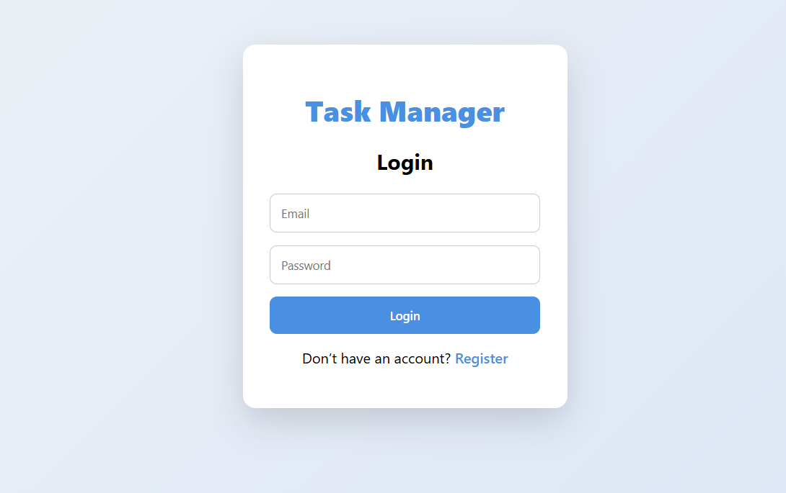
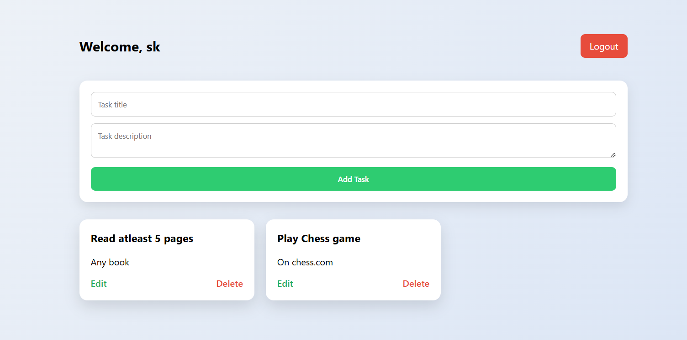
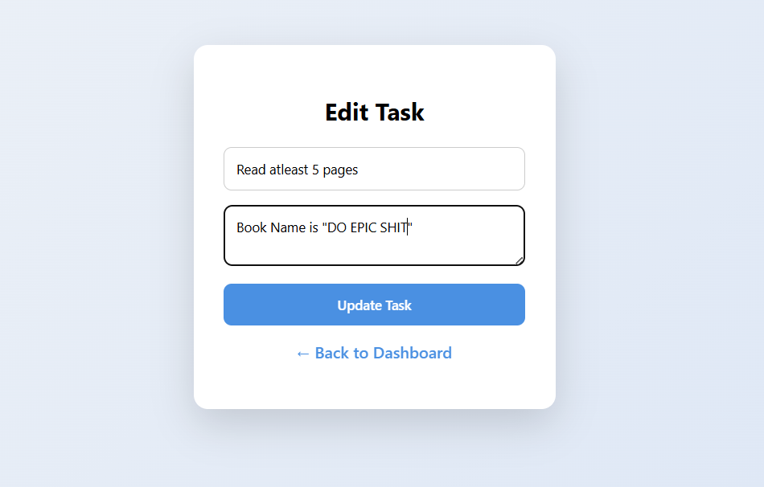

# Task Manager Web Application

This is a simple Task Manager web application developed as part of a Software Developer internship assessment.  
The application allows users to register, log in, and manage their tasks with full CRUD functionality.

-----

## 🚀 Features

- User Registration and Login
- Session-based Authentication
- Create, Read, Update, Delete (CRUD) Tasks
- User-specific task management
- MySQL database integration
- Clean and simple UI

-----

## 📸 Application Screenshots

### 🔐 Login Page


### 📋 Dashboard


### ✏️ Edit Task Page


---

## 🛠️ Tech Stack

- Backend: Flask (Python)
- Frontend: HTML, CSS
- Database: MySQL
- Version Control: Git & GitHub

-----

## 🛠️ Technologies & Libraries Used

- **Flask** – Python web framework for backend development
- **Flask-MySQLdb** – MySQL database integration with Flask
- **MySQLdb (mysqlclient)** – MySQL database adapter for Python
- **Werkzeug** – WSGI utility library (used internally by Flask)

-----

## ⚙️ Setup Steps

Follow the steps below to run the project locally:

1. Clone the repository:
   ```bash
   git clone https://github.com/Sarthak06Kumar/Task_Manager.git

2. Navigate to the project directory:
    cd Task_Manager

3. Create and activate a virtual environment:
    python -m venv venv
    venv\Scripts\activate

4. Install required dependencies:
    pip install -r requirements.txt

5. Create a MySQL database (example):
    CREATE DATABASE task_manager;

6. Update database credentials in config.py.

7. Run the Flask application:
    python app.py

8. Open the browser and visit:
    for example: http://127.0.0.1:5000

-----

## 🧠 Brief Explanation of the Approach

The project follows a simple and modular Flask architecture.  
User authentication is implemented using session-based login to ensure secure access.  
Each user can manage their own tasks, which are stored in a MySQL database.  
CRUD operations are handled through Flask routes and SQL queries.  
The frontend uses HTML templates and CSS for a clean and user-friendly interface.  
Git and GitHub were used for version control with multiple logical commits representing different development stages.

-----

## ✅ Test Cases to Verify Code and UI

### Authentication
- Register a new user with valid details → User should be created successfully
- Login with correct credentials → Redirects to dashboard
- Login with incorrect credentials → Error message displayed

### Task Management (CRUD)
- Add a new task → Task appears on dashboard
- View existing tasks → All user-specific tasks are displayed
- Edit a task → Task details update correctly
- Delete a task → Task is removed from the list

### Security
- Access dashboard without login → Redirects to login page
- Logout → Session cleared and redirected to login page

-----

## 📂 Project Structure

task_manager_flask/
│
├── app.py
├── config.py
├── requirements.txt
│
├── static/
│ └── css/
│ └── style.css
│
├── templates/
│ ├── login.html
│ ├── register.html
│ ├── dashboard.html
│ ├── edit_task.html
│
└── README.md


